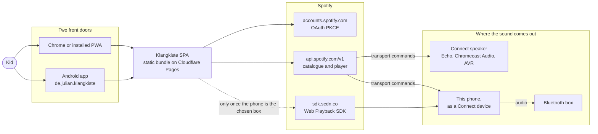
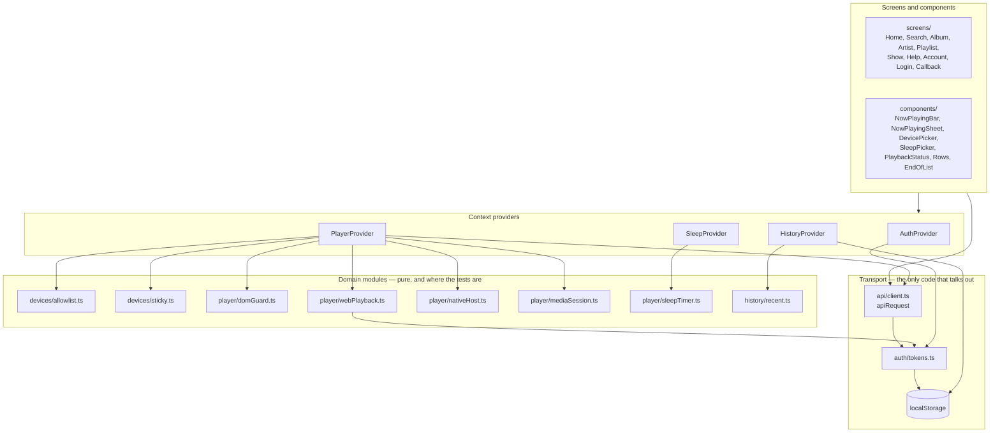
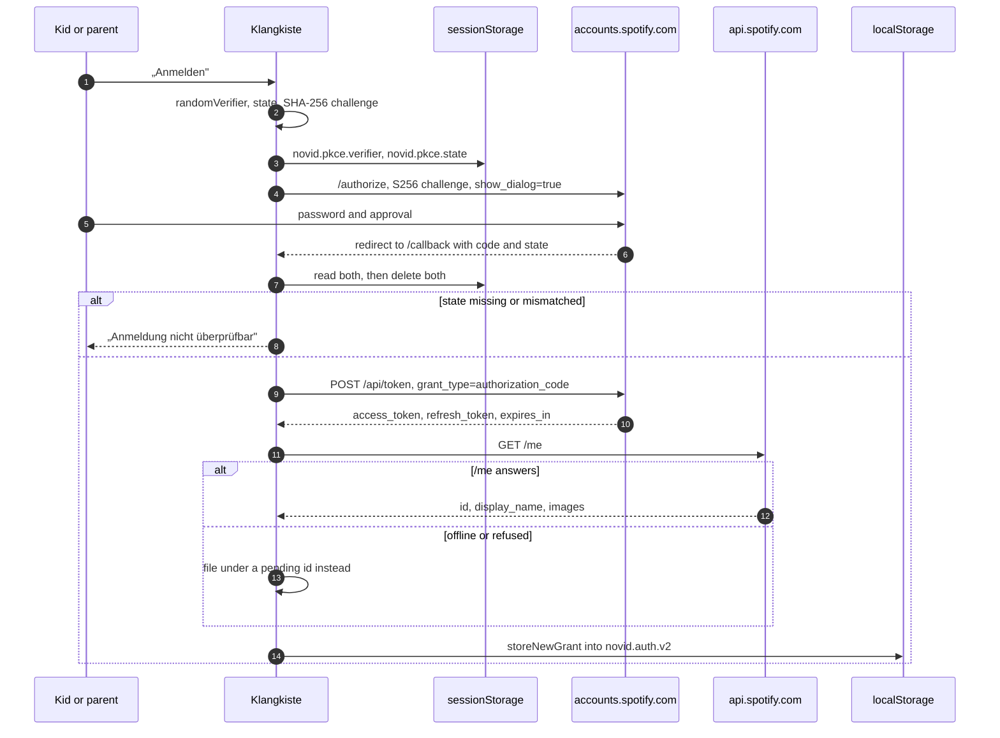
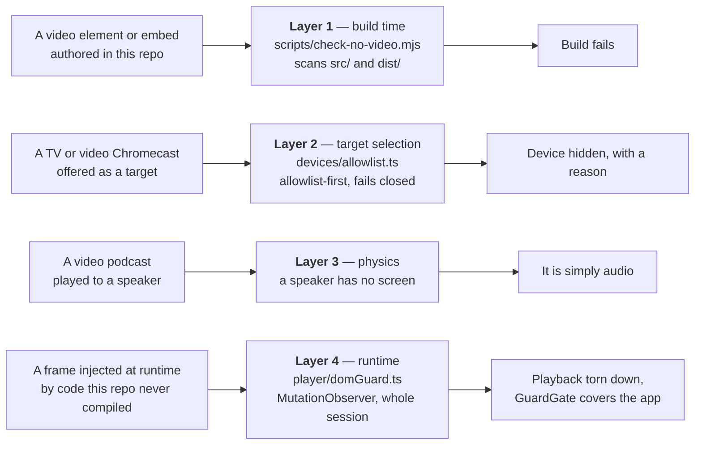
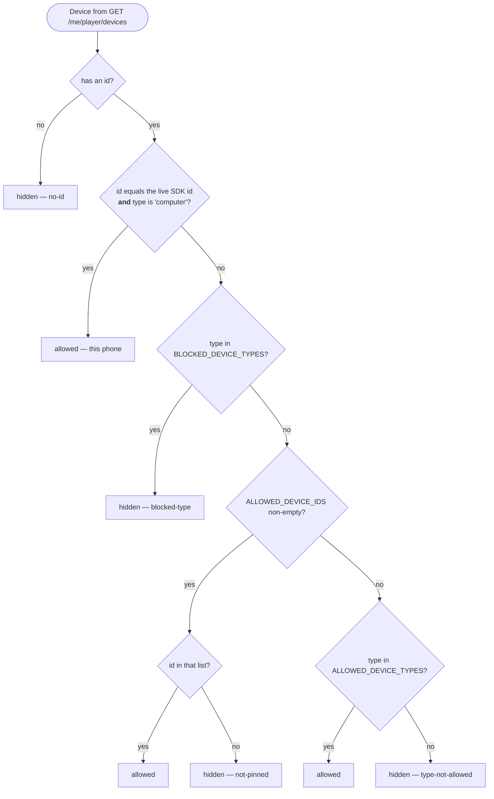
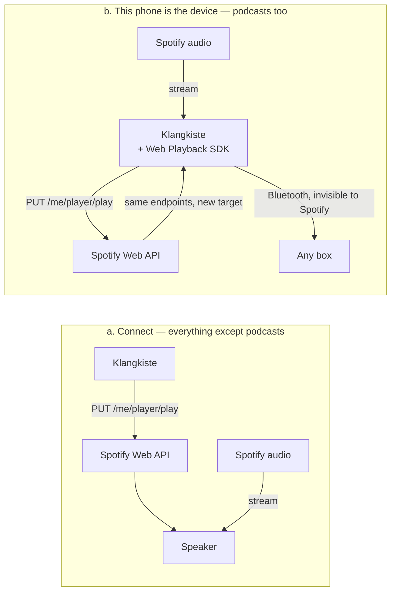
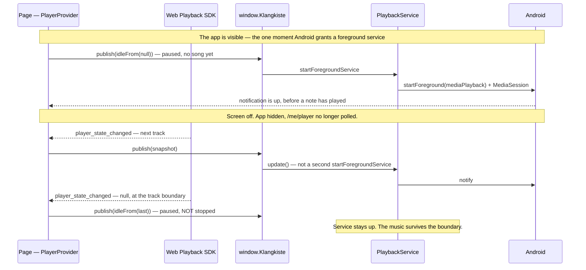
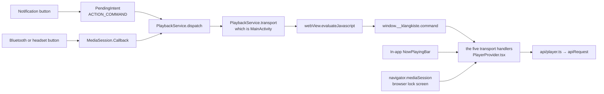
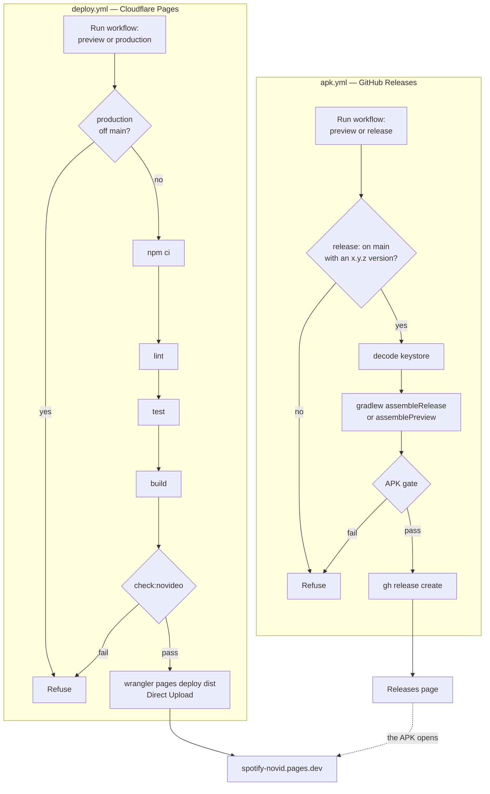

# Architecture

How Klangkiste is put together: the pieces, the boundaries between them, and the
flows that cross those boundaries.

For *why* any of it is the way it is — the reasoning behind the no-video
guarantee, the Android wrapper, and the phone-as-player detour — plus setup,
deployment and keystores, see [README.md](README.md). This document does not
repeat that; it draws the system the README describes.

## Contents

1. [What this is](#1-what-this-is)
2. [Repository layout](#2-repository-layout)
3. [Runtime architecture of the web app](#3-runtime-architecture-of-the-web-app)
4. [Authentication](#4-authentication)
5. [The no-video guarantee](#5-the-no-video-guarantee)
6. [Playback](#6-playback)
7. [The Android wrapper](#7-the-android-wrapper)
8. [Build, deploy and release](#8-build-deploy-and-release)
9. [Testing](#9-testing)

---

## 1. What this is

Klangkiste is a **Spotify Connect remote control**. It browses the catalogue and
tells a speaker what to play. For most of its life it never touches an audio
stream at all — the speaker streams directly from Spotify, and this app only
sends `PUT /me/player/play`. The one exception is podcasts, which Spotify
withholds from audio-only Connect devices; for those the phone itself registers
as a Connect device and reaches the box over Bluetooth instead. Section 6 covers
both topologies.

It is a static single-page app with no backend. Everything runs in the browser:
PKCE means there is no client secret to keep anywhere, so the whole thing is a
bundle on a CDN. The UI is German, aimed at roughly 10–13 year olds.

There are **two front doors onto one deployment**. In a browser it is an
installable PWA. On a phone managed by Family Link it is `de.julian.klangkiste`,
a single Activity holding a single WebView pointed at the same URL — not a fork,
not an offline copy. A content change ships by deploying the site; the APK does
not move.

Two external constraints shape everything downstream: playback control is
**Premium-only**, and the Spotify app stays in Development Mode, which caps it at
**five accounts**.



---

## 2. Repository layout

| Path | What lives there |
|---|---|
| `src/` | The web app. Everything the user actually interacts with. |
| `android/` | The WebView wrapper. Four Kotlin files, no dependencies at all. |
| `scripts/` | The no-video build gate, and the `spike*.mjs` measurement tools. |
| `public/` | Icons, `favicon.svg`, and `_redirects` for the SPA fallback. |
| `.github/workflows/` | `deploy.yml` (Cloudflare Pages) and `apk.yml` (GitHub Releases). |
| `dist/` | Build output — gitignored. Scanned by `check:novideo` after every build. |

Inside `src/`:

| Directory | Responsibility |
|---|---|
| `auth/` | PKCE flow, the multi-account token store, refresh. |
| `api/` | The Spotify Web API wrapper: one request choke point, catalogue, player, paging, types. |
| `devices/` | Which Connect devices may be played to, and remembering the choice. |
| `player/` | Playback orchestration: the Web Playback SDK, the DOM guard, the sleep timer, the two "something outside the page shows what is playing" adapters. |
| `history/` | Recently opened albums, playlists and shows, per account. |
| `screens/` | One file per route. |
| `components/` | Shared UI: the now-playing bar and sheet, the device picker, list plumbing. |
| `hooks/` | `usePagedList` (infinite lists) and `useOnline`. |
| `help/` | The ten troubleshooting topics behind the Hilfe tab. |
| `config.ts` | Build-time policy: scopes, the device allowlist, poll intervals, page sizes. |
| `strings.ts` | Every user-facing string. Code and comments stay English. |
| `errors.ts` | `toFriendlyError()` — a Spotify failure becomes a German sentence plus a help-topic deep link. |

---

## 3. Runtime architecture of the web app

React 19 + React Router + TanStack Query. There is no store library and no
reducer: shared state lives in four context providers, and everything else is
server state that TanStack Query owns.

The provider stack is the app's real skeleton (`src/main.tsx:28`,
`src/App.tsx:84`):

```
QueryClientProvider          cache, retry policy, background polling
  BrowserRouter
    AuthProvider             who is signed in; the only thing above the auth gate
      PlayerProvider         boxes, the chosen one, the SDK, the DOM guard
        SleepProvider        countdown; its one action is a pause, so it sits inside
          HistoryProvider    recently opened things, per account
            <Routes>
```

The order is load-bearing in two places. `AuthProvider` is outermost of the four
because `App` renders `<Login />` instead of the tree when `status !== 'signed-in'`
— nothing below it ever runs unauthenticated. `SleepProvider` is inside
`PlayerProvider` because it needs `command`, and above the routes so its countdown
survives navigation.



Two invariants this diagram exists to make visible:

- **Every Spotify Web API call goes through `apiRequest`** (`src/api/client.ts:76`),
  with exactly one deliberate exception noted below. No screen retries, refreshes a
  token, or handles a 429 — that is all in one place: 401 forces exactly one
  refresh-and-retry, 429 honours `Retry-After`, 202 ("the speaker took the command
  but has not acted on it") is retried three times a second apart rather than
  reported as success, and a 403 mentioning *premium* becomes
  `PremiumRequiredError` so it can be told apart from "this playlist is not yours
  to read".

  The exception is `fetchProfile` in `src/api/me.ts`, which takes an access token
  as an argument and calls `fetch` directly. `apiRequest` resolves the bearer token
  from the *active account*, and this one call happens at the moment there is no
  active account yet — the profile is what says which account to file the new
  tokens under.
- **`auth/tokens.ts` is the only module that touches the token store.** The store
  *shape* is in `auth/accounts.ts` as pure transforms, so it can be unit-tested in
  Node without a `localStorage`. `devices/allowlist.ts` and `devices/sticky.ts`
  split the same way.

### Server state

`QueryClient` is configured once (`src/main.tsx:10`): `staleTime` of five minutes
because catalogue data barely changes and the February 2026 API removed the batch
endpoints, so everything is fetched item by item and the cache does the work; one
retry, **except** for the 403 that means "not your playlist", which is never worth
asking twice.

`PlayerProvider` runs the only two polling queries:

| Query key | Interval | Notes |
|---|---|---|
| `['devices']` | 10 s | Speakers come and go as they are switched on. `select` partitions the list through `partitionDevices`. |
| `['playback']` | `PLAYBACK_POLL_MS` (3 s) | `refetchIntervalInBackground: false` — polling a hidden app burns rate limit for nothing. Section 7 explains what fills the gap. |

Long lists use `usePagedList` (`src/hooks/usePagedList.ts`) over
`useInfiniteQuery`, with `nextPageOffset` / `flattenPages` from `src/api/paging.ts`.
Entries carry their absolute position, because a row's position is what starts the
right song in a playlist this account cannot even list (see the README's last
section).

### Routes

| Path | Screen | Note |
|---|---|---|
| `/` | `Home` | Also holds „Deine Sachen". |
| `/suche` | `Search` | |
| `/album/:id`, `/artist/:id`, `/playlist/:id`, `/show/:id` | detail screens | |
| `/hilfe` | `Help` | `?thema=<id>` deep-links a troubleshooting topic. |
| `/konto` | `Account` | Account switcher, and the wrapper diagnostics panel. |
| `/callback` | `Callback` | Handled *before* the auth gate — see below. |
| `/library` | → `/` | Redirect, so old bookmarks keep the right tab lit. |

`/callback` is special-cased at the top of `App` (`src/App.tsx:60`): the OAuth
redirect lands there before any session exists, so it has to be reachable
regardless of auth status.

### Where errors surface

There is **no React error boundary**, deliberately. Failures are handled at four
named seams instead, each with a different audience:

| Seam | Handles |
|---|---|
| `errors.ts` → `toFriendlyError()` | Any `ApiError` at a render site: a German sentence plus a `HelpTopicId` to deep-link. Checks `navigator.onLine` first. |
| `components/ListStatus.tsx` | List-shaped failures, with a precedence — error → offline → loading → empty → ready — because all of those have zero rows and only the last has earned the word „leer". A 403 renders as a notice, not an error: Spotify answered, the app is not broken. |
| `AuthExpiredError` → `markExpired` | A dead grant, for that one account. |
| `GuardGate` | The one non-recoverable condition. |

`HelpTopicId` is the shared currency between them: `errors.ts`,
`player/selfFailure.ts` and the `?thema=` links all speak it, and
`src/help/topics.test.ts` fails if any of them names a topic that no longer
exists.

### Persistence

Everything is `localStorage` (plus two `sessionStorage` keys for the redirect),
no IndexedDB:

| Key | Contents |
|---|---|
| `novid.auth.v2` | The multi-account store. `novid.auth.v1` is migrated once and deleted. |
| `novid.device` | The remembered box, or the `@self` sentinel. |
| `novid.sleep` | The sleep timer's absolute deadline. |
| `novid.recent.<accountId>` | Recently opened albums, playlists, shows. |
| `novid.pkce.verifier`, `novid.pkce.state` | **sessionStorage** — single-use, must not outlive the redirect. |

Every parser is total. `readStore`, `parseRemembered`, `parseSleep` and
`parseRecent` return a safe default rather than throwing, and `parseRecent` drops
one malformed entry rather than the whole file — nothing stored here is worth a
blank app.

### PWA and offline

`vite-plugin-pwa` with `registerType: 'autoUpdate'`. Two Workbox settings are
load-bearing rather than default:

- `navigateFallback: '/index.html'` with **`navigateFallbackDenylist: [/^\/callback/]`**
  — every unknown path should boot the SPA, but `/callback` must reach the app
  fresh rather than being served a cached shell mid-OAuth. `public/_redirects`
  provides the same fallback at the host level, and is not optional: `/callback`
  has no file behind it, so without it the host 404s in the middle of signing in.
- One runtime cache: `https://i.scdn.co/*` `CacheFirst`, 300 entries for 30 days.
  Cover art is immutable and by far the heaviest traffic.

Offline has a distinct voice throughout rather than being folded into "error":
`hooks/useOnline.ts`, `usePagedList().isPaused`, and the `navigator.onLine` check
that `toFriendlyError` makes first.

---

## 4. Authentication

Authorization Code with PKCE, public client, no secret anywhere. The app supports
**several accounts at once** — five kids, one phone each, one shared codebase —
and switching between them is a purely local operation.



The verifier and state live in **sessionStorage**, not localStorage: they are
single-use and must not outlive the redirect they belong to.

`show_dialog=true` is not cosmetic. Spotify keeps its own session cookie on
`accounts.spotify.com`, so without it the authorize redirect sails straight
through and hands back whoever is already signed in there — a second family
member could never be added. The cost is one extra tap on the twice-yearly forced
re-authorization, which an adult is doing anyway.

A failing `/me` never costs the tokens. The account goes in under a
`pending:<timestamp>` id, and `backfillIdentity` re-keys it to the real Spotify id
at the next launch (`src/auth/AuthProvider.tsx:223`), dropping the pending row if
that id turns out to be stored already.

### The store

`novid.auth.v2` in localStorage: `{ version, activeId, accounts[] }`. Each account
carries its tokens, its `expiresAt`, its `authorizedAt` — Spotify's six-month
refresh-token cap runs from the *original* authorization and refreshing does not
reset it — and an optional `needsReauth`. A dead grant keeps its row, blanked of
tokens, so the account screen can offer a re-login *by name* instead of the person
silently vanishing. A `novid.auth.v1` single-session blob is migrated on first
read and the old key deleted.

Four invariants make "the kids never see a login screen" work; they are argued in
full at the top of `src/auth/tokens.ts` and only summarised here:

1. Refresh tokens are persisted, so closing the app or rebooting the phone costs
   nothing.
2. Spotify's PKCE refresh tokens are **single use** — the new one must be written
   before the new access token is handed out.
3. Concurrent refreshes are collapsed: per-account in-flight promises within a
   tab, and a `navigator.locks` lock named `novid.token.refresh` across tabs.
   Two tabs spending the same single-use token revokes the grant.
4. A refresh writes back to the account id it **started** with, never to whoever
   is active when it lands.

### Losing a session

`api/client.ts` raises `AuthExpiredError` when a grant is gone. `App` wires that
to `markExpired` through `setAuthExpiredHandler` (`src/App.tsx:56`), which tears
down **only the one dead account** — every other grant runs on its own clock and
stays perfectly usable. A `storage` event listener follows another tab that
switched, added or lost an account. Switching accounts also cancels and clears the
query cache: no query key is account-scoped, so a response that started under the
previous account would otherwise land unlabelled.

---

## 5. The no-video guarantee

The app's reason to exist, and the part worth reading twice. It is four
independent layers, each catching something the others structurally cannot.



**Layer 1** scans source *and* bundle, with different patterns for each
(`scripts/no-video-patterns.mjs`). Scanning `src/` is the half that matters: JSX
compiles to `jsx("iframe", …)`, so a bundle-only scan would have to know exactly
what the compiler emits, whereas an `<iframe>` in a `.tsx` file is plain text no
bundler can rename. `no-video-patterns.test.mjs` asserts the patterns still catch
every form, so the check cannot rot into a no-op — and the script fails if it
scanned zero files, which is the same failure mode as having no check at all.

**Layer 4** exists because layer 1 structurally cannot see the Web Playback SDK:
it is fetched from `sdk.scdn.co` at runtime and injects a cross-origin iframe, so
it appears in neither `src/` nor `dist/`, and Spotify can change what is inside it
without anyone here rebuilding. `watchDocument` observes `childList`, `subtree`
and the `src` / `srcdoc` attributes for the whole session. A frame with no `src`
yet is *pending*, not foreign — scripts routinely insert the element first — and
the observer re-checks it when the attribute is set. The one allowed origin is
matched by parsed origin, never `startsWith`, which would accept
`https://sdk.scdn.co.attacker.example`. When it trips it calls
`webPlayback.teardown()`, says `hostStopped()`, and sets `guardViolation`, which
`GuardGate` (`src/App.tsx:32`) renders as a full-screen, non-dismissible stop.

**Its limit cannot be engineered away**: same-origin policy means the *inside* of
Spotify's frame is not inspectable. Layer 4 guarantees this document, not that
one. What makes that tolerable is layer 3 — which is also the only layer that
survives an adversarial SDK, and the reason the most obvious-looking one is worth
keeping.

### The device decision

`rejectionReason()` (`src/devices/allowlist.ts:38`), in its real order:



Four things about that shape:

- **Allowlist-first, so it fails closed.** A device type nobody anticipated is
  hidden rather than offered.
- **Case-insensitive**, which is load-bearing rather than defensive: a real
  Chromecast Audio reports `"CastAudio"`.
- **The blocklist wins over the id pin**, so a pinned id cannot re-admit a TV by
  accident.
- **The phone is admitted by id *and* type together.** The SDK reports
  `type: "Computer"`, which is on the blocklist; widening the type allowlist would
  re-admit every desktop, one plugged into a TV included. Requiring the id the SDK
  minted this session means the worst a wrong id can do is admit another computer
  — which is what the blocklist already prevents.

`partitionDevices` keeps the rejects rather than filtering them away, with the
reason attached, so the UI can tell *"no speaker found"* (Spotify reported
nothing) from *"no speaker available"* (devices exist, all refused) and name each
one: `Living room TV (tv — can show video)`. It also splits the phone out into its
own `self` slot, because every consumer of `allowed` means *boxes*.

The allowlist lives in a committed file rather than a settings screen on purpose:
a settings screen would let a kid add the living-room TV back.

---

## 6. Playback



(b) exists for one reason: Spotify classifies podcasts as **mixed media** and
withholds them from audio-only Connect devices. An Echo Dot accepts the command,
reports that it is playing, and stays silent. A browser is not an audio-only
device, so it gets the episode — and the box is then reached over Bluetooth, as a
plain speaker Spotify never sees.

Everything downstream is unchanged, which is the point: the SDK registers as an
ordinary Connect device, so `src/api/player.ts` drives it through the same
`/me/player/*` endpoints as any speaker. `playEpisode`, seeking and the pollers
needed no changes at all. The costs are real and stated in the UI: the phone
streams instead of the box, spending its battery and mobile data, and until the
Bluetooth pairing is made the sound comes out of the phone.

### Who owns which state

The hardest thing to read out of the code, so it is a table:

| State | Owner | Lifetime |
|---|---|---|
| `remembered` — the chosen box | `PlayerProvider` + `localStorage['novid.device']` | Across launches |
| `selfId` — the live SDK device id | `PlayerProvider` | This session only |
| SDK singleton: `player`, `deviceId`, `bootPromise` | module scope in `player/webPlayback.ts` | This session only |
| `guardViolation` | `PlayerProvider` | Terminal — never cleared |
| Polled `/me/player` view | `stateQuery` in TanStack Query | Cached; not polled while hidden |
| Live per-track state | `player_state_changed` listeners via `webPlayback.onStateChange` | Push, keeps arriving while hidden |

The last two rows are a genuine duality rather than duplication. `stateQuery`
drives the UI and covers every device. The SDK's event stream covers only this
phone, but arrives instantly and — crucially — **keeps arriving when the poller is
deliberately switched off**. That is what feeds the Android notification through a
track boundary with the screen off (section 7).

### Remembering the box

The chosen device is sticky, and three rules govern it (`src/devices/sticky.ts`):

- **An explicit choice is never second-guessed.** If the box is not in the current
  list it is reported as *unavailable*, not silently replaced. Retargeting is how
  audio ends up in the wrong room.
- **It is forgotten only after `FORGET_AFTER_MISSES` (3) consecutive absent
  polls.** One missing poll is normal for a speaker that has gone idle.
- **This phone is stored as the sentinel `@self`, never as a device id.** The SDK
  mints a new id every session, so a stored live id would age out about thirty
  seconds into every launch. The sentinel is exempt from the miss counter for the
  same reason, and `selfSelected` is derived from the *stored choice* rather than
  from finding the device in the polled list — deriving it from the list made the
  bar announce „Dieses Handy ist gerade aus" for several seconds after every
  launch.

`selectSelf()` must be called straight from the tap: `activate()` unlocks audio
output, and iOS ignores playback not started by a real user gesture no matter how
many commands succeed afterwards. A previous session that left `@self` stored
re-boots the SDK on launch *without* `activate()` — there has been no tap, so the
device is merely registered and the first play unlocks it.

### The rest of the player

- **Transport** — five commands (`play`, `pause`, `next`, `previous`, `seek`)
  memoised once in `PlayerProvider` (`src/player/PlayerProvider.tsx:323`) because
  three surfaces offer them and they must not drift: the in-app bar,
  `navigator.mediaSession` in a browser, and the Android notification.
- **Sleep timer** — `player/sleepTimer.ts` is pure (start, remaining, decide,
  parse, serialise); `SleepProvider` is the clock around it. Its one action is a
  pause.
- **Queue and jump targets** — `player/queue.ts` and `player/jumpTargets.ts` feed
  „Was als Nächstes kommt", which is how a playlist this account does not own can
  still be navigated: `/playlists/{id}/items` answers a bare 403, but
  `/me/player/queue` names the next twenty songs once it is running.
- **History** — `history/recent.ts` keeps up to `RECENT_LIMIT` (8) recently opened
  albums, playlists and shows, keyed per account.

---

## 7. The Android wrapper

`android/` is one Activity holding one WebView. It exists because of Family Link
and nothing else: Chrome's *Add to home screen* mints a WebAPK whose launch hands
off to a Chrome activity, so the foreground package is `com.android.chrome` — and
Family Link enforces on the foreground package. Rendering in our own Activity is
the entire content of the wrapper. (A Trusted Web Activity would not have helped;
it renders through Chrome's Custom Tab activity and lands in the same place.)

It has **no dependencies at all** — not even AndroidX. Four files:

| File | Responsibility |
|---|---|
| `MainActivity.kt` | The WebView, its settings, the navigation allowlist, and the Kotlin→JS direction of the bridge. Implements `PlaybackService.Transport`. |
| `PlaybackService.kt` | The foreground service, its notification and `MediaSession`. |
| `PlaybackBridge.kt` | The four `@JavascriptInterface` methods, gated on a trust closure. |
| `Diagnostics.kt` | One slot for the last swallowed error, plus counters, serialised to JSON. |

### Why the service exists

When this phone is the box, the Web Playback SDK runs **in the page**. A frozen
app is therefore a stopped playlist: with the screen off, Android used to freeze
the WebView at the first track boundary, the song finished, the next one never
started, and a kid had to unlock and press play for every single track.

Three things prevent that, and all three are needed: `PlaybackService` as a
`mediaPlayback` foreground service, `setRendererPriorityPolicy(RENDERER_PRIORITY_IMPORTANT, false)`
so Android does not waive the renderer's priority when the WebView goes invisible,
and the deliberate *absence* of `webView.onPause()` / `pauseTimers()`.



Two rules in that diagram are counter-intuitive and both are about *when* Android
permits a foreground service to start — which is only while the app is visible:

- **The service is claimed when the phone is chosen, not when music starts.** The
  notification appears paused, before anything plays, and stays up until another
  box is picked. Tying it to the music meant reaching for it from a pocket, where
  the answer is no. Once one exists, later reports go through `instance.update()`
  rather than a second `startForegroundService`, because Android 12+ refuses a
  foreground start from the background.
- **A null SDK state means "track boundary", not "stopped".** `idleFrom` publishes
  a paused snapshot carrying the last title and cover, so the notification neither
  blanks out nor dies. Only two callers ever say `hostStopped()`: another box being
  chosen, and the DOM guard tripping.

There are four teardown paths in total: those two, the notification's `ACTION_STOP`
delete-intent when it is swiped away, and `MainActivity.onDestroy`.

### The bridge contract

Both directions are **version-tolerant by design**: the page deploys on its own
schedule and an installed APK may be older or newer than it.

**Page → wrapper.** Injected as `window.Klangkiste` by
`webView.addJavascriptInterface(PlaybackBridge(applicationContext) { pageTrusted }, "Klangkiste")`,
where `pageTrusted` is set in `onPageStarted` to `host == siteHost`. The page
detects the wrapper by the object simply being there (`inWrapper()` in
`src/player/nativeHost.ts:81`); every function in that file is a no-op in a
browser.

| Method | Untrusted page | Trusted page |
|---|---|---|
| `publish(json: String)` | refused, recorded in `Diagnostics` | parse `HostSnapshot`, hand to `PlaybackService` |
| `stopped()` | ignored | `PlaybackService.stop()` |
| `status(): String` | `{pageHost, trusted:false}` only | full `Diagnostics.asJson` |
| `openNotificationSettings()` | ignored | opens Android's per-app notification settings |

`publish`'s payload is
`{ playing, title, artist, artworkUrl?, durationMs, positionMs }`, read on the
Kotlin side with `optBoolean` / `optString` / `optLong` so a field the APK does not
know about costs nothing. On the TypeScript side `status` and
`openNotificationSettings` are declared optional, every call is wrapped, and
`HostStatus` is `unknown` until checked — an older wrapper missing a method must
never take the music with it.

**Wrapper → page.** `MainActivity` evaluates
`window.__klangkiste && window.__klangkiste.command('<name>'[, <number>])`. The
page installs that object in `bindHostCommands` (`src/player/nativeHost.ts:151`)
and removes it on teardown.



The service never talks to Spotify itself. That would be a second player
disagreeing with the one on screen.

### What the wrapper is careful about

- **Main-frame navigation is confined to an allowlist** — the deployed site plus
  `accounts.spotify.com` and `challenge.spotify.com` (2FA). Anything else opens in
  the system browser. Sub-frames are exempt (`if (!request.isForMainFrame) return false`)
  so the SDK's `sdk.scdn.co` iframe still loads. `open.spotify.com` is deliberately
  *not* on the list: it is the full web player, and it plays video. Without the
  allowlist the wrapper would be a browser with no content filter and no
  screen-time limit on a supervised phone — a worse hole than the one being fixed.
- **`RESOURCE_PROTECTED_MEDIA_ID` is the only permission request granted.** Spotify
  streams are Widevine-protected and a WebView denies EME unless asked. Everything
  else is denied.
- **The user agent has `; wv` stripped**, because the Web Playback SDK refuses a
  WebView UA.
- **`allowBackup="false"`**, because the WebView's storage holds a refresh token
  per account. For the same reason the `preview` build variant inherits from
  `release`, not `debug`: `adb run-as` into a debuggable app reads that directory.
- **A `PARTIAL_WAKE_LOCK` is held only while actually playing**, with a three-hour
  ceiling. No `WifiLock` — it is a documented no-op from Android 10.

### Diagnostics

Every link in the chain — the trust gate, the bridge, the service, the
notification permission — fails **silently on purpose**, because none of them is
worth stopping the music over. On phones that are never plugged into a laptop that
left „es geht nicht" as the entire diagnosis.

So `Diagnostics.kt` records what each link swallowed (one slot, not a growing
buffer — that is a leak with a nice name), `PlaybackBridge.status()` serialises it,
and `PlaybackStatus.tsx` polls it every 2 s and renders it as verdicts rather than
numbers on the „Konto" screen, with a button straight to Android's notification
settings. The same lines go to logcat under the tag `Klangkiste`.

---

## 8. Build, deploy and release

Both pipelines are **`workflow_dispatch` only**. Nothing deploys on push or merge,
and nothing publishes an APK by itself: a release APK is what ends up on the kids'
phones, so publishing one is a decision someone makes.



`check:novideo` runs **after** the build, because half of it scans `dist/`. That
ordering is what makes the app's core promise mechanical rather than a habit.

The APK gate is its Android counterpart, run against the built artifact with
`aapt2 dump badging` and `apksigner`. It refuses to publish anything that is
`application-debuggable`, signed with `CN=Android Debug` or not signed at all,
carrying any permission outside the allowed five (`INTERNET`,
`FOREGROUND_SERVICE`, `FOREGROUND_SERVICE_MEDIA_PLAYBACK`, `WAKE_LOCK`,
`POST_NOTIFICATIONS`), not `targetSdkVersion 34`, or carrying the wrong package,
label, or `SITE_URL` — the last read back out of the generated `BuildConfig.java`.

### Build-time configuration

| Variable | Read by | Effect |
|---|---|---|
| `VITE_SPOTIFY_CLIENT_ID` | Vite, inlined into the bundle | The Spotify app. Public by design — PKCE has no secret, and what actually protects the app is the redirect-URI allowlist in the dashboard. |
| `DEPLOY_TARGET` | `vite.config.ts:14`, in Node only | `preview` prefixes the tab title and the PWA name with „Prev-", so a preview never reads as production. |
| `klangkiste.siteUrl` | Gradle → `BuildConfig.SITE_URL` | The URL the WebView opens. Its `/callback` must be registered with Spotify. |
| `klangkiste.versionName` / `versionCode` | Gradle | `versionCode` comes from the run number, so it only climbs. |

Three build variants: `release`; `preview`, which is `initWith(release)` plus
`applicationIdSuffix = ".preview"` so it installs *beside* the real app and gets
its own Family Link limit; and `debug`, for a cable and a laptop only.

One coupling worth knowing: `apk.yml`'s `PRODUCTION_URL`, `gradle.properties`'
`klangkiste.siteUrl` default and the Pages project URL are three copies of one
fact, and both workflows independently enforce "production ships what is on
`main`".

---

## 9. Testing

Vitest, in happy-dom. The shape matters more than the count: **the pure modules
carry the tests, and the providers stay thin orchestration around them.** That is
why `devices/allowlist.ts` is separate from `PlayerProvider`, and `auth/accounts.ts`
separate from `auth/tokens.ts` — a module that reached for `localStorage` could not
be unit-tested at all.

| Area | Covered by |
|---|---|
| Device allowlist and partitioning | `src/devices/allowlist.test.ts` |
| Sticky device choice, the `@self` sentinel, the miss counter | `src/devices/sticky.test.ts` |
| `isForbidden` — telling „not your playlist" from „not Premium" | `src/api/client.test.ts` |
| Paging and offsets | `src/api/paging.test.ts` |
| Playlist item counts and entries across the old and new field names, search buckets | `src/api/catalog.test.ts` |
| List state precedence — error before offline before loading before empty | `src/components/ListStatus.test.ts` |
| The multi-account store transforms | `src/auth/accounts.test.ts` |
| The runtime no-video guard | `src/player/domGuard.test.ts` |
| Sleep timer, queue, jump targets, SDK failure messages | `src/player/*.test.ts` |
| The Android bridge's snapshot and idle semantics | `src/player/nativeHost.test.ts` |
| Recents and reference resolution | `src/history/*.test.ts` |
| No-video pattern coverage | `scripts/no-video-patterns.test.mjs` |

Two link-integrity tests earn their place by catching a class of rot no type can:
`src/App.nav.test.ts` and `src/help/topics.test.ts` walk the source for
`/hilfe?thema=<id>` deep links and fail if one points at a topic that no longer
exists.

`vite.config.ts:83` disables happy-dom's iframe and file loading. The DOM guard's
tests insert iframes on purpose; without that setting happy-dom tries to actually
fetch each one, turning a unit test into twenty seconds of DNS timeouts and making
the suite pass or fail depending on whether the machine is online.

### The spikes are not tests

`scripts/spike.mjs`, `spike-player.mjs` and `spike-playlist.mjs` are
**measurement** tools, run by hand against a real account and real hardware. The
device type strings in `config.ts`, the confirmation that a podcast plays through
the SDK, and the README's account of what the February 2026 API will and will not
answer for a playlist you do not own were all measured with them rather than read
from documentation. They are the thing to re-run before assuming any of it still
holds.
